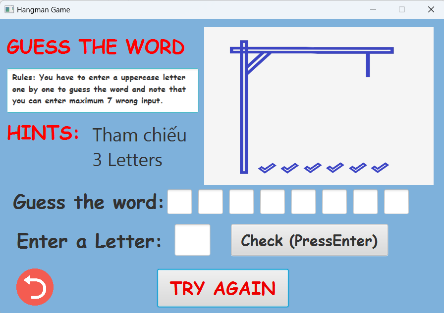
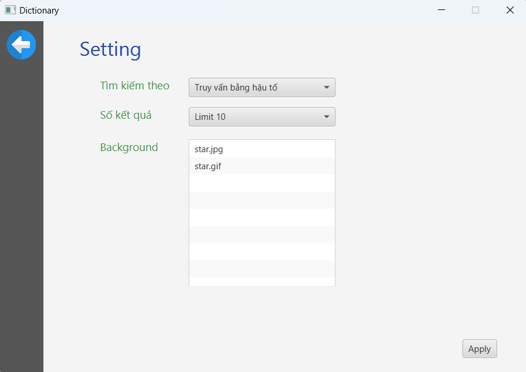
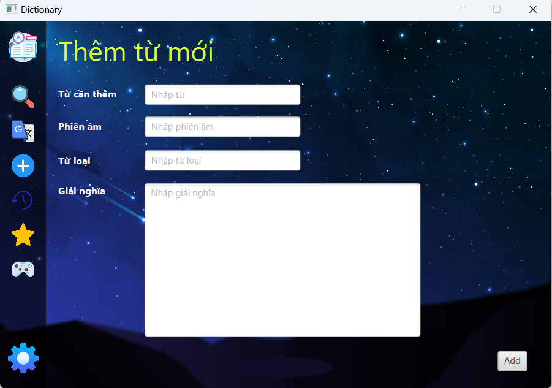
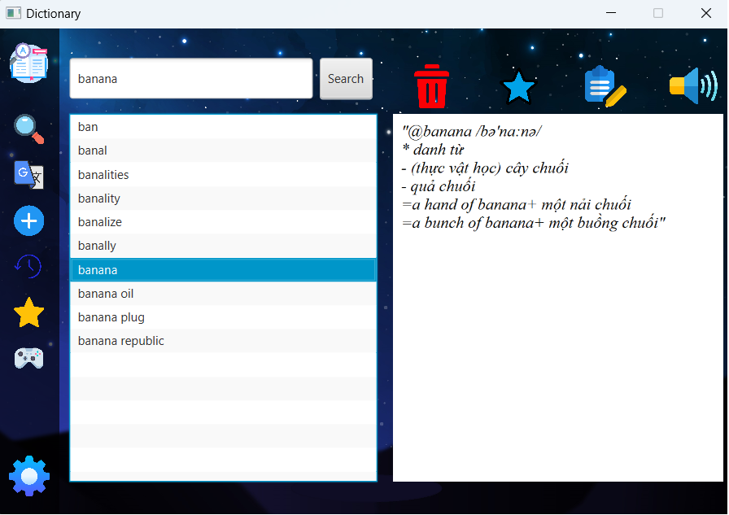

# Dictionary-OASIS-OOP

## Cài đặt

- Gắn javafx-sdk-21/lib, freetts-1.2/lib, mysql-connector.jar vào Project Structure/Library
- Gắn VM option : --module-path "Link đến javafx/lib" --add-modules javafx.controls,javafx.fxml,javafx.web
- Download csdl từ link sau : "https://drive.google.com/drive/folders/1V-0UCwkm7gdQojzbTBzW1WA7CFZfb395?usp=sharing"
- Cài đặt lại link đến csdl từ class DBConnection

## 1 số hình ảnh về từ điển
<table style="padding:10px">
  <tr>
    <td width="50%"></td>
    <td width="50%"></td>
  </tr>
  <tr>
    <td width="50%"></td>
    <td width="50%"></td>
  </tr>
</table>
